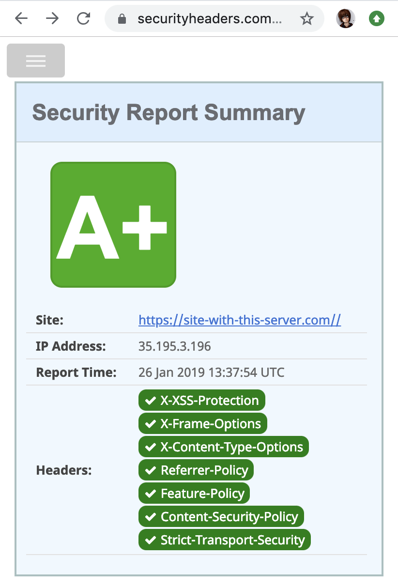

Static server
-------------

[](https://circleci.com/gh/microparts/static-server-php/tree/master)
[](https://codecov.io/gh/microparts/static-server-php)

Specific static server with support corporate standard of configuration and more..
This server is a simple wrapper for nginx or an any web server.

Server created for javascript SPA apps like: Vue, React, Angular, etc.

## Features

* Special created for modern web app's.
* Secure headers by default.
* If backend app will be hacked, the hacker may write a letter to us, because email address injected to head section of index (console message) :)
* Corporate config standard supported by default and injected too.
* Brotli-compression (Gzip used as fallback for outdated browsers). Enabled by default. [More](#Compression).
* Deny all `robots.txt` by default.
* Hot reload

## Docker usage

```Dockerfile
FROM microparts/static-server-php:2.0.2

ARG VCS_SHA1
ARG STAGE

# dist & frontend yaml configuration
COPY dist/ /app
COPY ./configuration /app/configuration
```

Full example can be founded [here](./example). And with local use [here](https://github.com/microparts/configuration-js#how-to-usage-library-with-spa-apps).

## CLI usage

CLI usage implies 2 commands for usage:

1) Start server:
```bash
server run
```

Result:
```bash
[2019-12-18 17:38:30] Server.INFO: State: STAGE=local SHA1= VERSION=2.0.2 CONFIG_PATH=/Users/roquie/google_drive/projects/microparts/static-server-php/configuration
[2019-12-18 17:38:30] Server.INFO: Files modification enabled. Have fun!.
[2019-12-18 17:38:30] Server.INFO: Nginx Brotli module not installed. Turning off this compression method.
[2019-12-18 17:38:30] Server.INFO: Check if platform supports async io...
[2019-12-18 17:38:30] Server.INFO: Platform does not supports async io, turning it off.
[2019-12-18 17:38:30] Server.INFO: Prerender is not enabled, skip check.
[2019-12-18 17:38:30] Server.INFO: Nginx PID location: /tmp/spa_nginx.pid
[2019-12-18 17:38:30] Server.INFO: nginx: the configuration file /tmp/generated_nginx.conf syntax is ok
[2019-12-18 17:38:30] Server.INFO: nginx: configuration file /tmp/generated_nginx.conf test is successful
[2019-12-18 17:38:30] Server.INFO: Server started at: 0.0.0.0:8080
```

2) Reload

After editing files or configuration you can reload server without restart master process.

```bash
server reload
```

Reload command result:
```bash
[2019-12-18 17:41:44] Server.INFO: Reload configuration
[2019-12-18 17:41:44] Server.INFO: State: STAGE=local SHA1= VERSION=2.0.2 CONFIG_PATH=/Users/roquie/google_drive/projects/microparts/static-server-php/configuration
[2019-12-18 17:41:44] Server.INFO: Files modification enabled. Have fun!.
[2019-12-18 17:41:44] Server.INFO: Nginx Brotli module not installed. Turning off this compression method.
[2019-12-18 17:41:44] Server.INFO: Check if platform supports async io...
[2019-12-18 17:41:44] Server.INFO: Platform does not supports async io, turning it off.
[2019-12-18 17:41:44] Server.INFO: Prerender is not enabled, skip check.
[2019-12-18 17:41:44] Server.INFO: Nginx PID location: /tmp/spa_nginx.pid
[2019-12-18 17:41:44] Server.INFO: nginx: the configuration file /tmp/generated_nginx.conf syntax is ok
[2019-12-18 17:41:44] Server.INFO: nginx: configuration file /tmp/generated_nginx.conf test is successful
[2019-12-18 17:41:44] Server.INFO: Configuration reloaded
```

3) Dump loaded configuration:
```bash
server dump
```

Result:
```bash
CONFIG_PATH = /app/configuration
STAGE = dev

server:
  host: 0.0.0.0
  port: 8080
  root: ./dist
  index: index.html
  modify:
    enabled: true
    root: ./dist/modified
    inject: before_script
  handler:
    name: nginx
    options:
      pid: /tmp/spa_nginx.pid
      config: /tmp/generated_nginx.conf
  prerender:
    enabled: false
    url: null
    resolver: "8.8.8.8 8.8.4.4 1.1.1.1 1.0.0.1"
    headers: []
  service_worker:
    enabled: false
  log_info: '%%cSTAGE=%s SHA1=%s; %%cSecurity bugs: security@spacetab.io, Job/partnership: work@spacetab.io'
  logger:
    enabled: true
    level: info
  security_txt:
    contact: security@spacetab.io
    preferred_lang: 'en, ru'
  headers:
    csp:
      - 'default-src ''self'''
      - 'script-src ''self'' ''unsafe-inline'' cdnjs.cloudflare.com'
      - 'img-src ''self'' data:'
      - 'style-src ''self'' ''unsafe-inline'' fonts.googleapis.com cdnjs.cloudflare.com'
      - 'font-src ''self'' data: fonts.gstatic.com cdnjs.cloudflare.com'
      - 'form-action ''self'''
    feature_policy:
      - 'geolocation ''none'''
      - 'payment ''none'''
      - 'microphone ''none'''
      - 'camera ''none'''
      - 'autoplay ''none'''
    referer_policy: no-referrer
    pragma: public
    xss_protection: '1; mode=block'
    x_content_type: nosniff
    x_content_type_options: nosniff
    x_ua_compatible: IE=edge
    sts: 'max-age=86400; includeSubDomains; preload'
```

Comments about server configuration can be found [here](./configuration/defaults).

## How it works?

Server reads files from `dist`, then modifying `index.html` on the fly and append configuration before first `<script>` tag will be founded.
 Also available [insert config before first tag](./configuration/defaults/___server.yaml#L8) to `<head>` section (but it blocks page painting).

Injected config file (`__config.js`) has following content:

```js
window.__stage = 'local';
window.__config = JSON.parse('{}' /* frontend config from yaml here */);
window.__vcs = '%s';

console.log('%%cSTAGE=dev SHA1=55b5293; %%cSecurity bugs: security@spacetab.io, Job/partnership: work@spacetab.io','color:#F44336','color:#009688');
```

Also, will be injected `<link>` tag with `rel=preload`. [More](https://developers.google.com/web/tools/lighthouse/audits/preload).

Then, starts the nginx server.

## Headers

By default will be added following headers to response:
```http
Pragma: public
X-XSS-Protection: 1; mode=block
X-Frame-Options: SAMEORIGIN
X-Content-Type: nosniff
X-Content-Type-Options: nosniff
X-Ua-Compatible: IE=edge
Referrer-Policy: no-referrer
Feature-Policy: geolocation 'none'; payment 'none'; microphone 'none'; camera 'none'; autoplay 'none'
Content-Security-Policy: default-src 'self'; script-src 'self' cdnjs.cloudflare.com; img-src 'self' data:; style-src 'self' 'unsafe-inline' fonts.googleapis.com cdnjs.cloudflare.com; font-src 'self' data: fonts.gstatic.com cdnjs.cloudflare.com; form-action 'self'
Strict-Transport-Security: max-age=604800; includeSubDomains; preload
```

`A+` rating issued by the site https://securityheaders.com.


<br>

### CSP header

Frontend-developer should be use `Content Security Policy` protection,
i.e configure server himself.

It creates a `server.yaml` config file and add it to stage directory
`dev/prod/local` (or only to `defaults` folder) with following contents:

```yaml
dev:
  server:
    headers:
      csp:
        - default-src 'self' *.teamcsrv.com *.teamc.io
        - script-src 'self'
        - "img-src 'self' data:"
        - style-src 'self' 'unsafe-inline' fonts.googleapis.com
        - "font-src 'self' data: fonts.gstatic.com"
        - form-action 'self'
```

And it edit in accordance with business logic of application.

### Link header

As new feature since `1.1.4` version you able to use `Link` header
for server configuration.

* How it use for `<link rel=preload>` requirements (lighthouse), – https://w3c.github.io/preload/#example-3 , https://w3c.github.io/preload/#example-6
* Specification https://tools.ietf.org/html/rfc5988#section-5

Example:

```yaml
dev:
  server:
    headers:
      link:
        - value: </app/style.css>; rel=preload; as=style; nopush
        - value:
            - <https://example.com/app/script.js>
            - rel=preload
            - as=script
```

## Compression

By default server use Brotli-compression algorithm developed by [Google Inc](https://en.wikipedia.org/wiki/Brotli). <br>
If a more [effective](https://medium.com/oyotech/how-brotli-compression-gave-us-37-latency-improvement-14d41e50fee4) (up to 21%) lossless compression algorithm than gzip and deflate.<br>
<br>
For the present, his support all modern browsers:
https://caniuse.com/#search=Brotli

## Environment variables

Server read the following environment variables:

```bash
CONFIG_PATH – server and frontend configuration.
STAGE – server and frontend mode to start: prod/dev/local
VCS_SHA1 – build commit sha1 for debug
```

## Default files in the root directory

By default root directory is `/app`. It special for container-based usage. <br>
Root directory contains following files from scratch:
```
.
├── favicon.ico
├── index.html
└── robots.txt
```

* `favicon.ico` – is a transparent `.ico` file (for prevent error logs).
* `index.html` – simple index file with hello message.
* `robots.txt` – the file which blocks all robots by default.
* `/.well-known/security.txt` – https://securitytxt.org/

Each file can be replaced.

## Tests

Install packages for development using composer and just run following command:

```
vendor/bin/phpunit
```

```
PHPUnit 8.5.0 by Sebastian Bergmann and contributors.

Runtime:       PHP 7.4.0 with Xdebug 2.9.0
Configuration: /Users/roquie/google_drive/projects/microparts/static-server-php/phpunit.xml

......................                                            22 / 22 (100%)

Time: 403 ms, Memory: 10.00 MB

OK (22 tests, 40 assertions)
```

## License

GNU GPL v3
